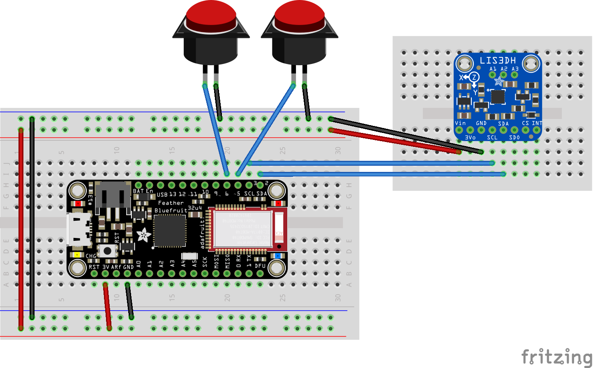

# BleController
### Bluetooth controller using Adafruit Bluefruit Feather 32u4 Bluefruit LE

This project uses an [Adafruit Feather 32u4 Bluefruit LE](https://learn.adafruit.com/adafruit-feather-32u4-bluefruit-le) to act as a HID mouse for an android tablet.  For movement input it uses the [Adafruit LIS3DH Triple-Axis Accelerometer](https://learn.adafruit.com/adafruit-lis3dh-triple-axis-accelerometer-breakout) attached to an ALS patients foot.  There are two simple arcade buttons used for left click and a scroll toggle. 

## Project Purpose

Several years ago my mother was diagnosed with ALS.  Since then she has slowly lost the function of her limbs.  She loves the Android game Fishdom and at first she could play it normally.  As she lost function she could no longer use the touch screen to control the game.  At that time I made a wired version of this controller using an arcade joystick to control the mouse movement, and the same two buttons to act as a click and a scroll toggle.  As time when on she lost more function and the joystick became hard to use.  She still has pretty good movement of her foot when in her chair so I decided to try and use an accelerometer to control the mouse movement.  Once I got that working I wanted to make it wireless to the tablet so that she wouldn't have to stop playing to charge the tablet.  

The code by this time was getting a little large and I didn't want to break something while trying to implement a new feature or while tweking a setting so I figured it was time to finally learn Git.  The bulk of the code was written in the Arduino IDE, I then discovered VSCode and its Git integration and have starting using it for my development.  

With any luck this project may help another disabled person have some entertainment.  

## Wiring

Wiring is fairly simple.  You will need four wires connecting the Feather to the Accelerometer (two if you want to give the Accelerometer its own power supply) and four wires to connect the buttons to the Feather (two for each button).  I used a Cat5 cable between the main housing box (which has the buttons and the Feather) and the foot control box (which has the Accelerometer) because I had keystones I could fasten to the boxes and I wanted a quick way to disconnect the Accelerometer from the rest of the system.  

* Connect the SCL pin of the Feather to the SCL pin of the Accelerometer
* Connect the SCA pin of the Feather tot he SCA pin of the Accelerometer
* Connect the Vin pin of the Accelerometer to 3V or 5V
* Connect the Gnd pin of the Accelerometer to Ground
* Connect one lead of the main button to pin 5 on the Feather (this can be changed in code)
* Connect the other lead to Ground
* Connect one lead of the scroll toggle button to pin 12 on the Feather (this can be changed in code)
* Connect the other lead to Ground

